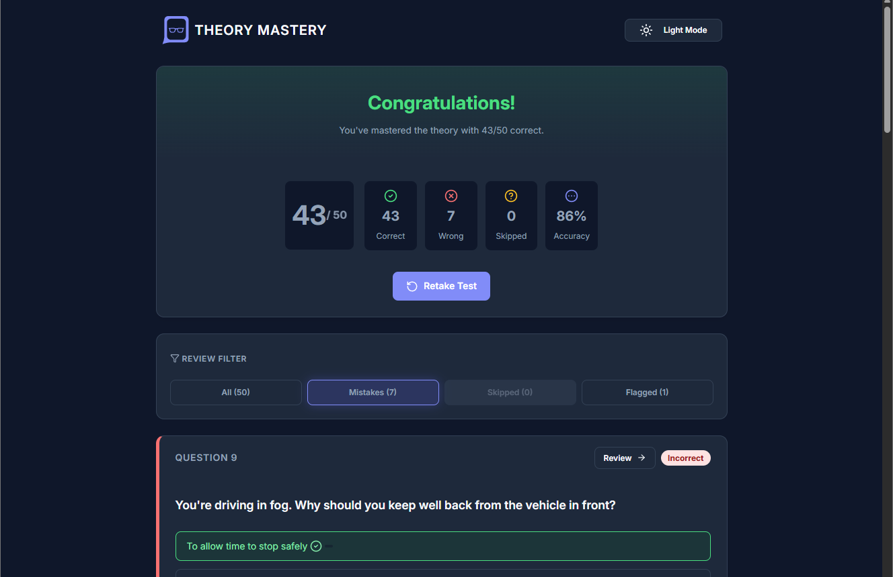
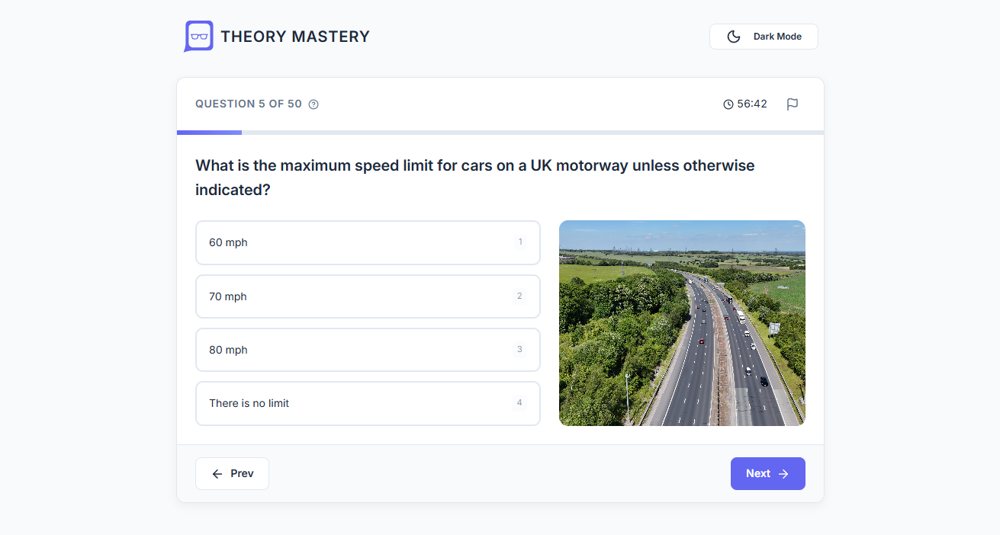

# 🚗 Theory Mastery

https://theory-mastery.netlify.app/

high-performance driving theory practice application built with React. Designed to simulate the real exam environment with added tools for deep review and progress tracking.

## 👍 My Challenges:

- **State Management for Large Quizzes:** Managed a complex state (answers, bookmarks, timers) across multiple views using the `useReducer` and `useMemo` hooks to ensure the app remained performant even with 50+ questions.
- A detailed results viewing and review page has been created.
- I focused on creating a clean and aesthetically pleasing layout.
- Designed the application to be responsive across different screen sizes.

## 🛠️ Build With:

- React JS
- Semantic HTML5 markup
- CSS Flexbox and Grid
- Mobile-first workflow
- Custom CSS properties

## ⌨️ Keyboard Shortcuts

Speed up your practice with built-in shortcuts:

- **Next / Previous:** `Right Arrow` / `Left Arrow`
- **Select Options:** `1`, `2`, `3`, `4`
- **Flag Question:** `F`
- **Quick Submit:** `Enter`
